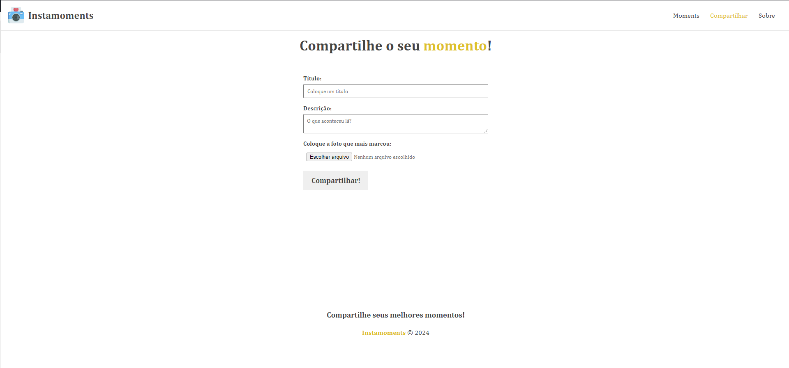

<h1 align="center">Instamoments</h1>

## 💻 Sobre o projeto

<p>
InstaMoments é uma rede social projetada para compartilhar momentos importantes com amigos. Com o InstaMoments, você pode capturar e compartilhar seus momentos mais preciosos com as pessoas que importam para você.
</p>

## Pré-visualização

Aqui está uma pré-visualização do projeto em execução:



### Pré-requisitos

Ter um client-api como Postman ou Insomnia para testar os endpoints.
Antes de começar, você vai precisar ter instalado em sua máquina as seguintes ferramentas:
[Node.js](https://nodejs.org/en/)
[VSCode](https://code.visualstudio.com/)

## Recursos

- Criar e gerenciar momentos
- Adicionar fotos aos seus momentos
- Visualizar todos os momentos
- Comentar em posts de momentos de outros usuários

## Tecnologias Utilizadas

O projeto foi desenvolvido utilizando as seguintes tecnologias:

- **[AngularCLI](https://angular.io/)**
- **[AdonisJs](https://adonisjs.com/)**

## Como Instalar e Executar

Primeiramente, faça um clone do repositório.

```bash
# clone o repositório
$ git clone https://github.com/WillianGiacomelli/markthedate.git
```

### - Inicialize o servidor

```bash
# entre no diretório
$ cd instamoments

# entre no repositório backend
$ cd backend

# instale as dependências
$ npm install

# inicie o servidor
$ node ace serve
```

### - Inicialize o frontend

```bash
# entre no diretório
$ cd instamoments

# entre no repositório backend
$ cd instamoments

# instale as dependências
$ npm install

# inicie o servidor
$ ng serve
```

## 📝 Licença

Este projeto esta sobe a licença [MIT](./LICENSE).

Feito por Willian Giacomelli 👋🏽 [Entre em contato!](https://www.linkedin.com/in/williangiacomelli/)
